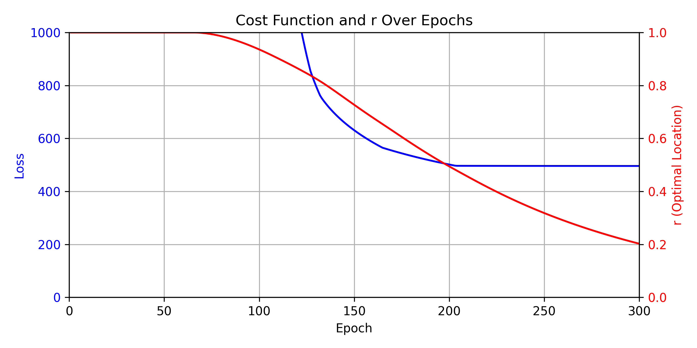
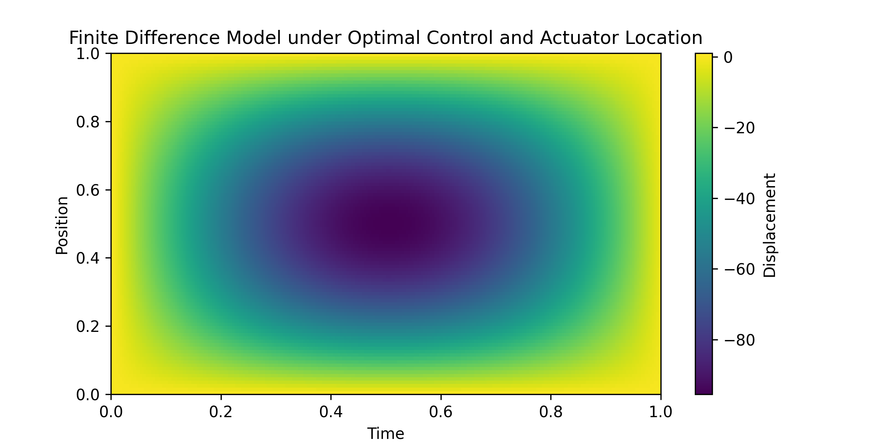
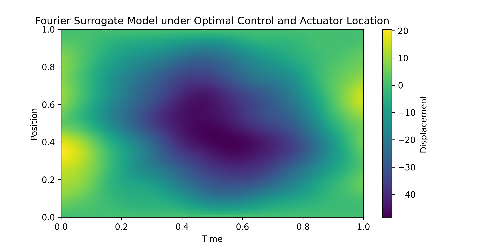

# Scientific Machine Learning for Optimal Control and Actuation

This project leverages scientific machine learning to determine the optimal control input and actuator location to stabilize a 1D wave equation.

## Problem Setup

We consider the 1D wave equation on the domain $x \in [0, 1]$ with zero Dirichlet boundary conditions:

$$
\frac{\partial^2 u}{\partial t^2} = c^2 \frac{\partial^2 u}{\partial x^2} + f(x, t),
$$

where:
- $u(x, t)$: displacement at position $x$ and time $t$,
- $c$: wave speed,
- $f(x, t)$: external force applied at position $r$, i.e., $f(x, t) = u_{\text{in}}(t) \cdot \delta(x - r)$.

Our goal is to find the optimal input $u_{\text{in}}$ and actuator location $r$ that minimizes the cost function:

$$
J(u_{\text{in}}, r) = \int_0^T \left( \int_0^L u(x, t)^2 \, dx + \gamma \cdot u_{\text{in}}(t)^2 \right) dt,
$$

where $\gamma$ is a weighting parameter for the control effort. The Dirac delta function is approximated by a Gaussian function:

$$
\delta(x_i - r) = \delta_0 \frac{\exp\left(-\frac{(x_i - r)^2}{2 (\Delta x)^2}\right)}{\sum_{i} \exp\left(-\frac{(x_i - r)^2}{2 (\Delta x)^2}\right)},
$$

where $\Delta x$ is the spatial resolution.

## PyTorch Implementation

The Python file `main.py` demonstrates how to model and solve this optimization problem using PyTorch.

To run this project, follow these steps:

1. Clone the repository:
    ```bash
    git clone https://github.com/sajjadedalatzadeh/scientific-ML-1DWave.git
    cd scientific-ML-1DWave
    ```

2. Ensure you have matplotlib and PyTorch installed. Install additional dependencies if needed:
    ```bash
    pip install torch matplotlib
    ```

3. Run the main script to perform the optimization and generate results:
    ```bash
    python main.py
    ```

4. View the generated plots (`loss_and_r_over_epochs.png`, `wave_propagation.png`, and `control_input.png`) in the project directory.

## Simulation Results




